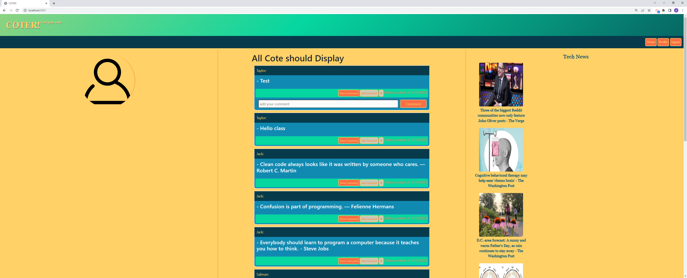

# COTER

## Description
- To create an environment to build a network between developers to communicate through this specialized platform.
- An environment to help beginners fit into fast-growing developer community.
- Breaks down the communication barrier.
- Explored many libraries like handlebars, ORM, express.js, MVC, font-kit and much more including several third party APIs.

## Desgin and Develop by:
- Rudri Joshi - full Stack engineer
- Andrew Persaud - full Stack engineer
- Milad Esmaeelpour - full Stack engineer

## Table of Contents
- [Installation](#installation)
- [Usage](#usage)
- [Credits](#credits)
- [License](#license)

## Installation

```
- source database
- install packages
- seed database
- run app
```

## Usage

- https://coter-app-ead89d3057b0.herokuapp.com/

## Credits
- Mark Alfano
- Sal Hobbi
- Source for the seeded quotes(https://techvify-software.com/35-best-coding-programming-quotes/)
- Source for the seeded quotes(https://betterprogramming.pub/101-funny-programmer-quotes-76c7f335b92d)

## License

[MIT License](https://choosealicense.com/licenses/mit/)

## Badges


## Questions

please contact for more information via
- [Andrew Persaud](https://github.com/andythepee)
- [Rudri Joshi](https://github.com/rudrijoshi)
- [Milad Esmaeelpour](https://github.com/miladesmailpour)

  
